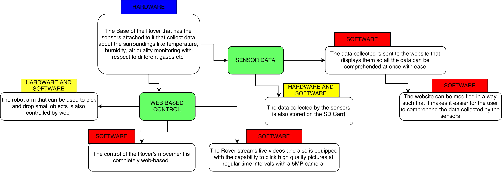

# Multipurpose Rover

#### Course Project for Introduction to Engineering Design (IED)
#### Instrctor : Dr. Alexander Fell

• This rover collects sensor data of vital environmental parameters like temperature, humidity, content of various gases, altitude, gps position etc. and stores them as well as allows us to analyse them by plotting them using MATLAB in form of histograms. It streams live video, provides real time coordinates and has a unique feature of complete web based control i.e. it is completely controlled by the user using the web capabilty(web-app). It is also equipped by a robo-arm that helps us pick and drop small objects.
 
• The sensor data is collected and analysed using Arduino and MATLAB, while the web-control of motors and robo-arm is done using the Raspberry-pi through a self made web-app.
 
• It can be used for industrial, agricultural and astronomical purposes.

Skills used: Arduino Programming, MATLAB, Raspberry Pi Programming in Python, Circuit Designing, Web Development

## Block Diagram Explaining the functioning

## Contents

1) Work Breakdown Structure (WBS) : Key project deliverable that organizes the team's work into manageable sections.
2) Gantt Diagram : Graphical illustration of a schedule that helps plan, coordinate and track specific tasks in a project. Contains a time line along with tasks scheduled to be done during that time.
3) Circuit Diagrams : All circuit diagrams required in the project.
4) Poster : For display during poster presentation 
5) Block Diagram : Diagram explaining the funcitoning of the complete project.
6) Codes : Codes involved in the project
7) Final Report : Compilation of all files needed for final presentation.

